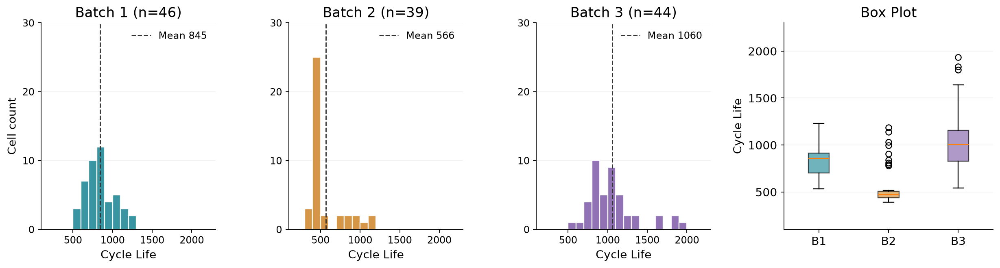
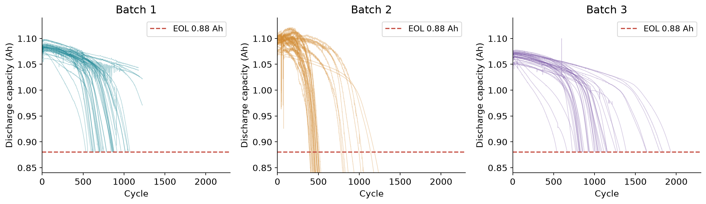
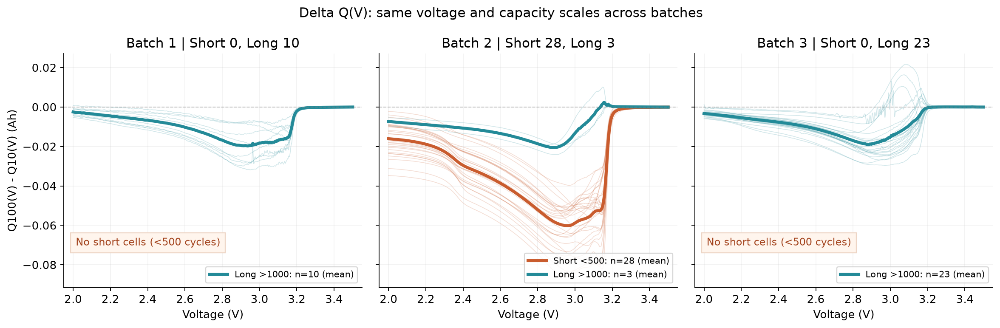
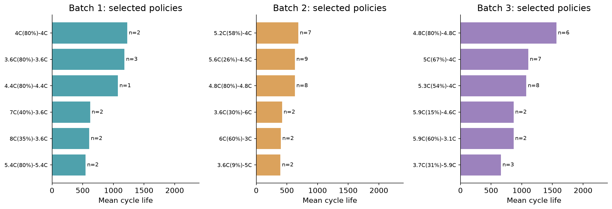
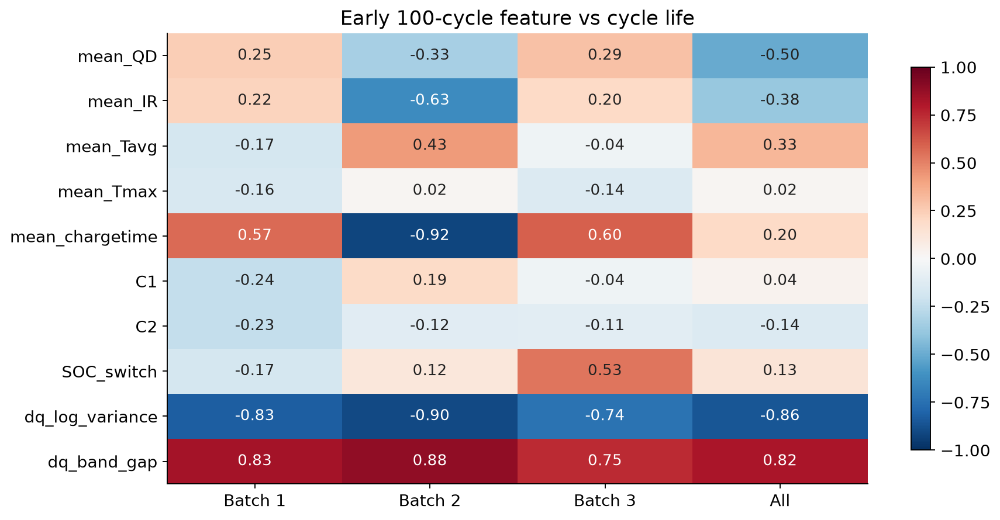
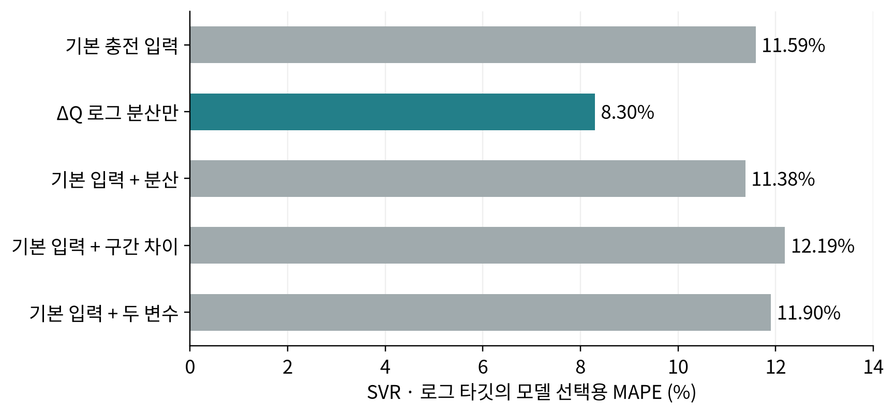
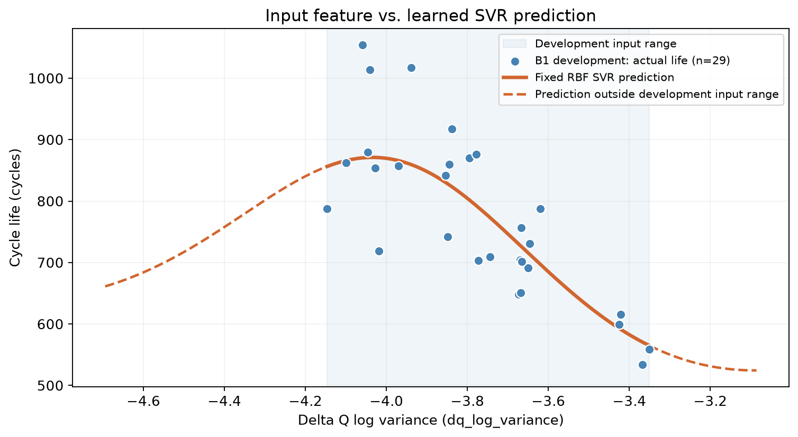
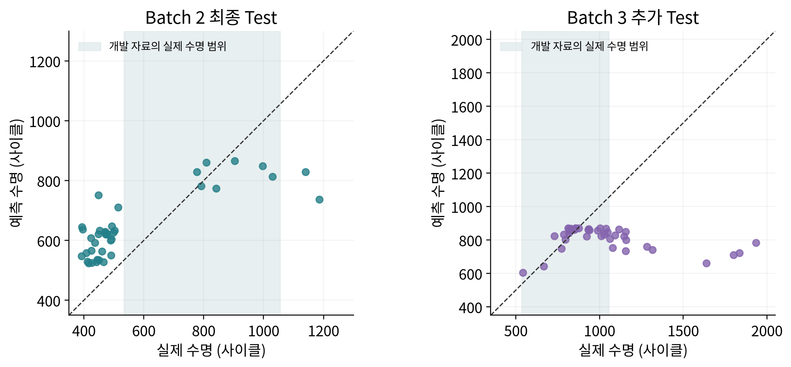

# ESS 배터리 수명 예측

배터리의 **초기 100사이클 데이터로 전체 수명인 `cycle_life`를 예측**하고, 학습에 사용하지 않은 배치에서도 예측이 유지되는지 확인한다. 초기 용량 변화에서 유용한 특징을 찾고, 그 특징을 선택한 이유와 실제 성능을 함께 설명하는 것이 목적이다.

이번 프로젝트는 결과 숫자뿐 아니라 **원자료 처리 → EDA → 파생변수 → 모델 선택 → 평가** 과정을 이해하는 데 중점을 둔다. 최종 모델은 ΔQ 로그 분산을 입력으로 사용하는 RBF SVR이며, Batch 2 MAPE는 **28.08%**로 과제의 논문 비교 기준 9.1%에는 미달했다.

## 프로젝트 개요

- 데이터셋: MIT–Stanford Battery Dataset, Severson et al., _Nature Energy_ (2019).
- 학습 데이터: Batch 1 (`2017-05-12`).
- 필수 평가 데이터: Batch 2 (`2018-02-20`).
- 추가 평가 데이터: Batch 3 (`2018-04-12`).
- 태스크: **Regression — Cycle Life 예측**. 분류는 진행하지 않았다.
- 분석 단위: 배터리 셀 1개. 예측 시점은 100사이클 종료다.
- 타깃: 제공된 `cycle_life`, 전체 수명 사이클 수. 논문은 공칭 용량의 80%까지 감소하는 시점을 수명 종료로 정의한다. [원 논문](https://web.mit.edu/braatzgroup/Severson_NatureEnergy_2019.pdf)
- 구현: Python, pandas, NumPy, h5py, scikit-learn. 모델 학습은 CPU에서 수행했다.

| 데이터  | 원시 셀 | 수명 값이 유효한 EDA 셀 | 모델 대상 셀 | 역할                     |
| ------- | ------: | ----------------------: | -----------: | ------------------------ |
| Batch 1 |      46 |                      46 |           36 | 개발 29개 + Hold-out 7개 |
| Batch 2 |      47 |                      39 |           39 | 최종 Test                |
| Batch 3 |      46 |                      44 |           40 | 고정 모델의 추가 Test    |

수명 값이 없거나 무효인 셀은 먼저 제거했다. 후속 파일에서 이어서 실험한 셀, 종료 수명이 불완전한 셀, 저자가 잡음 채널로 제외한 셀은 모델 사용 여부를 구분했다. `model_eligible`은 이 과정에서 추가한 표시이며 모델 입력은 아니다. 자세한 기준과 실제 적용 코드는 DAY 2 노트북의 1단계에 있다.

제공된 Batch 2는 **2018-02-20 파일**이다. 저자 코드의 다른 날짜 배치로 대체하거나 후속 셀을 임의로 연결하지 않았다. `2018-04-03_varcharge` 파일은 이번 분석에서 제외했다.

## 파일 구조

현재 프로젝트의 주요 파일 구조는 다음과 같다. 데이터 처리·특징 생성·학습 코드는 단계별로 나누어 **DAY 2 노트북 안에서 전부 확인할 수 있다.**

```text
├── 30-ESSHealth-Day1-EDA.ipynb       # DAY 1 EDA와 초기 모델 설계 기록
├── 30-ESSHealth-Day2-Modeling.ipynb  # MAT 읽기부터 최종 평가까지 실행
├── DAY2-model-learning.py          # DAY 2 노트북과 같은 순서의 참고 코드
├── DAY2-변수설명.md                 # 원자료 필드·계산 변수·모델 객체 설명
├── DAY2-learning/                  # 노트북 실행 중 생성하는 결과
│   ├── three_batches_eda_data.json.gz
│   ├── data_audit.csv
│   ├── cell_features.csv
│   ├── DAY2-split-manifest.csv
│   ├── candidate-results.csv
│   ├── best-model.joblib
│   ├── evaluation-predictions.csv
│   ├── performance-report.csv
│   └── verification.json
├── DAY2-performance-report-batch3.csv
├── DAY2-results-summary.json       # 이전 실행과의 선택적 비교용 기록
├── DAY2-requirements.txt
├── DAY2-README.md                  # 상세 실행 안내
├── PROJECT_LOG.md                  # 단계·결정·가정·맥락 기록
└── README.md
```

CSV·GZ·분할 목록은 별도로 준비해야 하는 입력이 아니다. **MAT 세 파일을 읽어 이 노트북에서 생성하는 중간 결과**다. 원자료는 용량이 커서 실행 자료 ZIP에 포함하지 않는다.

## 환경 설정

실행 확인 환경은 Python 3.14.6, scikit-learn 1.9.0, h5py 3.16.0이다. GitHub 저장소를 내려받거나 압축을 해제한 폴더에서 실행한다.

```bash
git clone https://github.com/asbazq/skala-min_project.git
cd skala-min_project
python3 -m venv .venv
source .venv/bin/activate
python -m pip install -r DAY2-requirements.txt
```

다음 원자료 세 파일을 준비하고, DAY 2 노트북 **1-1의 `RAW_DIR`**을 해당 폴더로 설정한다.

```text
2017-05-12_batchdata_updated_struct_errorcorrect.mat
2018-02-20_batchdata_updated_struct_errorcorrect.mat
2018-04-12_batchdata_updated_struct_errorcorrect.mat
```

현재 원자료 위치:

```text
/Users/jang/Documents/data-science/skala-ds/90-MiniProject/data/data-30
```

Jupyter 또는 VS Code에서 [DAY 2 노트북](30-ESSHealth-Day2-Modeling.ipynb)을 열고 위에서 아래로 실행한다. 코드만 실행하려면 `DAY2-model-learning.py`의 `RAW_DIR`을 설정한 뒤 아래 명령을 사용한다.

```bash
python DAY2-model-learning.py
```

**중간 파일이 없는 빈 폴더에서 MAT부터 전체 실행했으며**, 생성한 특징·분할·선택 모델·평가 결과가 기존 실행과 일치함을 확인했다. 검증 기록은 [verification.json](DAY2-learning/verification.json)에 있다.

## EDA

### Cycle Life 분포

배치별 히스토그램과 Box Plot을 같은 축으로 비교했다. 아래는 수명 값이 유효한 **EDA 표본** 기준이다. 모델에서 제외한 셀이 일부 포함되므로 개발 29개 분포와 구분한다.

| 배치    | 평균 수명 |  중앙값 |  단수명 <500 | 장수명 >1,000 |
| ------- | --------: | ------: | -----------: | ------------: |
| Batch 1 |     844.7 |   858.5 |   0/46, 0.0% |  10/46, 21.7% |
| Batch 2 |     565.7 |   472.0 | 28/39, 71.8% |    3/39, 7.7% |
| Batch 3 |   1,059.7 | 1,005.5 |   0/44, 0.0% |  23/44, 52.3% |



- **핵심 발견:** Batch 2는 단수명 셀이 많고, Batch 3는 장수명 비중이 높다.
- **시사점:** Batch 1 내부 검증이 좋아도 다른 배치에서 같은 성능을 기대하기 어렵다. Batch 2·3를 별도로 평가하고, 수명 범위가 달라지는 구간의 오차를 확인한다.

### 열화 곡선 분석

초기 용량이 유지되거나 조금 증가한 뒤, 후반에 감소가 빨라지는 셀들이 보였다. 100사이클 용량이 2사이클보다 큰 셀은 Batch 1 42/46, Batch 2 25/39, Batch 3 37/44였다. 초기 용량이 비슷해도 전체 수명은 달랐다.



- 장수명 셀은 용량을 더 오래 유지하는 경향이 있고, 단수명 셀은 더 이른 사이클에 수명 종료 구간에 도달했다. 모든 셀의 감소를 일정한 직선으로 설명하기는 어렵다.
- 대표 셀에 직선 두 개를 맞춘 Knee 후보는 Batch 1 `b1c28` 약 628사이클, Batch 2 `b2c16` 약 365사이클, Batch 3 `b3c0` 약 843사이클이었다. 전체 셀의 공통 Knee나 물리적 열화 시작점을 확정한 결과는 아니다.
- **핵심 발견:** 초기 전체 용량만으로는 이후 열화와 수명 차이를 충분히 설명하기 어렵다.
- **시사점:** 초기 전압별 변화인 ΔQ를 확인한다. 전체 곡선으로 계산한 Knee·마지막 용량·기록 길이는 100사이클 예측 입력에서 제외한다.

### ΔQ(V) 곡선 분석

같은 셀·같은 전압에서 `ΔQ(V) = Q100(V) − Q10(V)`를 계산했다. `Vdlin`과 `Qdlin`은 원자료 필드이며, `voltage`, `q10`, `q100`은 이를 꺼내 담은 코드 이름이다.



**그래프 읽는 방법:** Short는 수명 500사이클 미만, Long은 1,000사이클 초과다. Batch 1·3에는 Short 셀이 각각 0개여서 곡선이 없다. Batch 2의 주황색은 Short 28개, 청록색은 Long 3개다. 진한 선은 집단 평균, 옅은 선은 개별 셀이다. 세 패널은 같은 축 범위를 사용하며 500~1,000사이클 셀은 이 비교 그림에서 제외했다.

- 장단수명 셀 사이에 변화 폭과 형태 차이가 보였다. Batch 2에는 두 집단이 모두 있어 배치 안에서도 비교할 수 있다. Batch 1·3에는 500사이클 미만 셀이 없으므로 극단 집단 비교에는 배치 차이가 함께 섞인다.
- 모델 대상 셀에서 로그 분산과 수명의 상관계수는 Batch 1 −0.827, Batch 2 −0.902, Batch 3 −0.742였다.
- **핵심 발견:** 전체 용량 차이가 작아도 전압별 변화에는 수명과 연결되는 신호가 있었다.
- **시사점:** ΔQ를 로그 분산과 전압 구간 차이로 요약하고, 최종 사용 여부는 Batch 1 개발 CV로 판단한다.

### 충전 속도(C-rate)와 수명의 관계

프로토콜별 평균 수명은 달랐지만 첫 C-rate 하나로 수명 순서를 설명하기 어려웠다. 예를 들어 Batch 2에서 `3.6C(9%)-5C`의 평균 수명은 394.5사이클(2개), `5.2C(58%)-4C`는 685.1사이클(7개)이었다. 첫 단계가 낮아도 이후 충전 조건과 전환 시점이 다르다.



- 첫 C-rate와 수명 상관은 Batch 1 −0.235, Batch 2 +0.191, Batch 3 −0.039로 방향이 일정하지 않았다.
- **핵심 발견:** 충전 조건은 첫 C-rate, 두 번째 C-rate, 전환 SOC를 함께 봐야 한다.
- **시사점:** 세 조건을 기본 후보 입력으로 넣고, 같은 프로토콜의 셀은 그룹으로 묶어 검증한다. 적은 표본의 정책 평균만으로 고속 충전의 인과 효과를 확정하지 않는다.

### 추가 확인: 상관관계와 변수 중복



- 초기 평균 충전 시간과 수명의 상관은 Batch 1 +0.570, Batch 2 −0.917, Batch 3 +0.598이었다. 전체 상관만 보면 배치별 방향 차이를 놓칠 수 있다.
- 두 ΔQ 변수의 상관은 −0.959로 강했고, 평균·최대 온도도 +0.865로 정보가 겹쳤다.
- **핵심 발견:** 로그 분산은 배치마다 같은 방향의 관계를 보였지만 다른 신호는 배치에 따라 달랐고, 일부 변수는 서로 중복됐다.
- **시사점:** 상관이 강하다는 이유만으로 여러 변수를 모두 넣지 않는다. 입력 조합별 CV를 비교하여 필요한 정보만 선택한다.

## Modeling

### 피처 엔지니어링 전략

#### EDA에서 실제 구현까지의 연결

| 확인한 내용                                                | 설계 판단                               | 실제 반영                                         |
| ---------------------------------------------------------- | --------------------------------------- | ------------------------------------------------- |
| 초기 전체 용량이 비슷해도 수명이 다르고 ΔQ에는 차이가 있음 | 초기 전압별 변화를 요약                 | ΔQ100−10에서 두 후보 생성 후 개발 CV 비교         |
| ΔQ 변수끼리 상관 −0.959                                    | 추가 변수가 기존 정보를 보완하는지 확인 | 단일·추가 입력 조합 비교 후 로그 분산 하나 선택   |
| 같은 충전 프로토콜의 셀이 반복됨                           | 새 조건의 평가를 위해 그룹 분할         | 그룹 Hold-out·안쪽/바깥 CV, 셀·프로토콜 중복 점검 |
| 개발 셀 29개로 표본이 작음                                 | 복잡도를 제한한 후보부터 비교           | 정규화 선형 모델·RBF SVR·얕은 Random Forest 비교  |
| 배치마다 수명 분포가 다름                                  | 내부 검증과 배치 간 평가를 구분         | 고정 모델의 Valid·Batch 2·Batch 3 및 오류 분석    |

기본 후보는 `C1`, `C2`, `SOC_switch`, 초기 2~100사이클의 `mean_chargetime`이다. 추가 파생변수는 아래 두 개만 비교했다.

| 파생변수          | 계산 방법                          | 만든 이유                                                                                     |
| ----------------- | ---------------------------------- | --------------------------------------------------------------------------------------------- |
| `dq_log_variance` | `log10(var(Q100 − Q10))`, `ddof=0` | 전압 구간별 초기 변화가 얼마나 불균일한지 숫자 하나로 요약하고 수명 예측에 도움이 되는지 확인 |
| `dq_band_gap`     | ΔQ의 2.8 ~ 3.1V 평균 − 2.0 ~ 2.5V 평균 | 전체 분산이 놓칠 수 있는 구간별 변화 위치와 형태 차이가 추가 정보가 되는지 확인               |

ΔQ는 1,000개 값이므로 작은 개발 표본에 곡선 전체를 그대로 넣기보다 요약값을 비교했다. 두 번째 변수의 전압 구간은 DAY 1 정의를 유지했고 Test 점수로 바꾸지 않았다.

같은 SVR·로그 타깃에서 입력 조합별 설정을 개발 CV로 선택한 결과는 다음과 같다.

| 입력 조합             | 선택용 CV MAPE (%) |
| --------------------- | -----------------: |
| 기본 충전 변수        |              11.59 |
| 로그 분산만           |           **8.30** |
| 기본 + 로그 분산      |              11.38 |
| 기본 + 전압 구간 차이 |              12.19 |
| 기본 + 두 파생변수    |              11.90 |



로그 분산만 사용한 조합이 가장 낮아 최종 입력으로 선택했다. 구간 차이는 기대한 추가 효과를 이번 SVR에서 확인하지 못해 제외했다. 이는 다른 모델에서도 항상 무의미하다는 뜻은 아니다. 각 조합의 설정도 따로 선택했으므로 변수 하나의 순수한 인과 효과를 증명한 비교는 아니다.

셀 ID·배치·사용 여부는 입력에서 제외했다. 미래에야 알 수 있는 마지막 용량·Knee·전체 기록 길이도 제외했다. 온도·IR·평균 QD는 이번 후보 범위에서 보류했다.

### 보류한 변수와 그 근거

상관계수는 모델 대상 115개 셀에서 계산한 배치별 Pearson 상관이다.
전체 배치 EDA를 이미 본 상태에서 정한 후보 범위이며, 완전한 블라인드 Test는 아니다.
최종 후보 선택은 Batch 1 개발 자료로 한정했다.

| 변수                                      | 실제로 확인한 내용                                                                                                    | 이번 비교에서 보류한 이유                                                                            |
| ----------------------------------------- | --------------------------------------------------------------------------------------------------------------------- | ---------------------------------------------------------------------------------------------------- |
| 평균·최대 온도 (`mean_Tavg`, `mean_Tmax`) | 두 변수의 상관이 +0.865. 평균 온도와 수명의 상관은 Batch 1 −0.173, Batch 2 +0.425, Batch 3 −0.039                     | 온도끼리 정보가 겹치고 수명과의 관계도 배치마다 달라, 작은 개발 표본에서 ΔQ와 충전 조건을 먼저 비교  |
| 평균 IR (`mean_IR`)                       | 평균 IR과 수명의 상관은 +0.224, −0.626, +0.201. 정리 후 Batch 2의 6개 셀에서 평균 IR이 결측이며 Batch 1에는 결측 없음 | 관계 방향과 측정 가용성이 배치마다 다름. IR을 추가한 후보와 결측 대치 효과는 후속 개발 실험으로 남김 |
| 초기 평균 방전 용량 (`mean_QD`)           | 평균 QD와 수명의 상관은 +0.250, −0.333, +0.292. 초기 용량이 유지되거나 증가하는 셀도 많음                             | 초기 평균값 하나의 배치 간 관계가 일정하지 않아, 전압별 변화인 ΔQ를 우선 검증                        |

**보류는 성능이 나빠서 제외했다는 뜻이 아니다.** 이 변수들을 추가한 모델의 CV는 이번에 비교하지 않았다.
상관이 작거나 방향이 다르더라도 비선형 관계·다른 변수와의 조합은 도움이 될 수 있다.
후속 실험에서는 Batch 1 개발 자료에서 하나씩 추가해 같은 그룹 분할로 비교해야 한다.
근거: [배치별 상관 표](correlations.csv), [초기 측정 품질 표](input_quality.csv).

### 모델 선택 및 근거

| 후보 모델          | EDA와 연결한 선정 이유                                                             |
| ------------------ | ---------------------------------------------------------------------------------- |
| Ridge              | 작은 개발 표본에서 단순한 관계를 확인하고, 겹치는 변수의 영향을 제한하는 기준 모델 |
| ElasticNet         | 정보가 중복되는 변수의 영향을 줄이는 선택이 도움이 되는지 확인                     |
| RBF SVR            | 초기 변화와 수명의 관계가 직선으로만 설명되지 않을 가능성을 반영                   |
| 얕은 Random Forest | 충전 조건의 조합과 구간별 차이를 비교하되 과도한 분할을 제한                       |

- **최종 모델:** RBF SVR, `C=1`, `epsilon=0.01`, `gamma=0.1`.
- **최종 입력:** `dq_log_variance` 하나.
- **타깃 처리:** `ln(cycle_life)`로 학습하고 예측값을 `exp`로 역변환하여 MAPE를 계산했다.
- **선택 이유:** 모델 4종, 입력 5조합, 원래/로그 타깃 및 설정을 포함한 340개 후보 중 Batch 1 개발 자료의 선택용 CV가 가장 낮았다. 이 후보 범위 안에서 최적이라는 의미다.

Batch 1 프로토콜 그룹의 20%를 Hold-out으로 두고 시드 42를 사용했다. 개발 29개에서 안쪽 3-fold로 선택하고 바깥 5-fold로 선택 과정의 성능을 확인했다. 셀·프로토콜 중복은 Hold-out과 CV에서 점검했다.

결측 대치와 표준화는 각 학습 부분에서만 계산하도록 Pipeline으로 묶었다. 최종 모델은 개발 29개로 학습한 뒤 고정하고, Valid·Batch 2·Batch 3에는 예측만 수행했다. 평가 점수로 다시 선택하거나 Batch 1 전체 36개를 합쳐 재학습하지 않았다.

### 최종 SVR의 예측 곡선

가로축은 입력인 ΔQ 로그 분산, 세로축은 모델이 예측한 사이클 수명이다. 주황색 선은 저장된 모델의 예측이며, 파란 점은 개발 셀의 실제 수명이다. 배경은 개발 입력 범위, 점선은 그 범위 밖의 예측이다. 실제 수명과 예측 수명을 비교하는 그림의 대각선 기준선과 구분한다. 범위 밖에서 평평해지거나 방향이 바뀌는 현상을 배터리의 물리 법칙으로 해석하지 않는다.



## 성능 결과

회귀 지표는 **MAPE(%)**다. 아래는 Batch 3를 추가한 과제 양식이다.

| 구분                     | 추가 비교           | MAPE (%) | 비고                                     |
| ------------------------ | ------------------- | -------: | ---------------------------------------- |
| Train (Batch 1 CV)       |                     |    15.40 | 개발 29개, 바깥 5-fold 중첩 그룹 CV 평균 |
| Valid (Batch 1 Hold-out) |                     |    11.87 | 고정 Hold-out 7개                        |
| Test (Batch 2)           |                     |    28.08 | 고정 모델, 39개 전체                     |
|                          | Gap (Train-Valid)   |    −3.53 | Valid − Train, %p                        |
|                          | Gap (Valid-Test)    |   +16.21 | Batch 2 − Valid, %p                      |
|                          | Gap (Target-Test)   |   +18.98 | Batch 2 − 9.1, %p                        |
| Test (Batch 3)           |                     |    18.85 | 동일한 고정 모델, 40개 전체              |
|                          | Gap (Batch2-Batch3) |    −9.23 | Batch 3 − Batch 2, %p                    |
|                          | Gap (Target-Test)   |    +9.75 | Batch 3 − 9.1, %p                        |

**Gap은 뒤 평가의 오차가 증가하면 양수**가 되도록 계산식을 명시했다. MAPE는 %, Gap은 %p다.

Train 15.40%는 모델·변수·설정을 고르는 전체 과정의 바깥 CV 평균이다. 바깥 폴드마다 선택 모델이 달랐으며 최종 고정 SVR의 학습 오차가 아니다. **선택용 CV 8.30%를 Train이나 Test 대신 보고하지 않는다.**

논문 비교 기준 9.1%보다 Batch 2 오차가 18.98%p 높아 목표에 도달하지 못했다. 다만 중앙값 예측 기준 모델의 Batch 2 MAPE 56.47%보다는 개선됐다. 논문과 제공 배치·정제·분할이 동일한 조건은 아니므로 완전한 논문 재현이라고 해석하지 않는다.

### 세 가지 CV·평가 값을 구분하기

| 값                 | 데이터와 역할                                                                              |                         결과 |
| ------------------ | ------------------------------------------------------------------------------------------ | ---------------------------: |
| 선택용 CV          | 개발 29개 전체에서 같은 안쪽 3-fold로 후보를 비교. 최종 조합을 고르는 점수                 |                        8.30% |
| Train (Batch 1 CV) | 바깥 5-fold마다 안쪽 3-fold로 후보를 다시 선택하고, 선택에 쓰지 않은 바깥 셀을 평가한 평균 |                       15.40% |
| Valid / Test       | 개발 29개로 학습한 최종 SVR을 고정하고 새 셀을 예측                                        | Valid 11.87%, Batch 2 28.08% |

**Train 15.40%는 최종 SVR 하나의 고정 설정 CV가 아니라 모델·입력·설정을 고르는 전체 과정의 검증이다.**
바깥 폴드의 선택 모델은 SVR, SVR, Ridge, Random Forest, Ridge였고,
검증 MAPE는 각각 7.20%, 9.82%, 7.25%, 14.30%, 38.43%였다.
검증 셀이 서로 다르므로 이 다섯 점수만으로 모델 순위를 정하지 않는다.
최종 선택은 개발 29개의 동일한 선택용 CV 분할에서 비교한 결과로 결정했다.

MAPE가 낮을수록 좋다. 선택용 CV 8.30%를 새 배치 성능으로 제시하지 않는다.
바깥 CV 편차가 크므로 선택이 표본 구성에 민감했음을 함께 설명한다.

Train CV는 선택 과정, Valid는 고정 모델의 평가이므로 Train-Valid Gap에는 평가 절차·학습 표본·프로토콜 구성 차이도 포함된다. 하나의 고정 모델에서 과적합 정도만 잰 값으로 해석하지 않는다.

바깥 CV 표준편차는 13.20%p로 컸다. 개발 29개와 Hold-out 7개는 작은 표본이므로, Valid가 Train보다 낮다는 사실만으로 과적합이 없다고 확정하지 않는다. DAY 1에서 Batch 2·3 EDA를 이미 보았으므로 완전한 블라인드 Test라고 주장하지 않는다.

## 오류 분석

### 모델이 가장 크게 틀린 셀의 공통점

Batch 2에서 오차율이 가장 큰 세 셀은 개발 수명 범위보다 짧았으며 수명을 과대 예측했다.

| 셀    | 실제 수명 | 예측 수명 | 절대 오차율 (%) |
| ----- | --------: | --------: | --------------: |
| b2c18 |       449 |     751.1 |           67.29 |
| b2c6  |       393 |     644.4 |           63.98 |
| b2c15 |       396 |     637.0 |           60.85 |

Batch 3에서는 `b3c7`(실제 1,836 → 예측 721.4)처럼 장수명 셀을 크게 과소 예측했다. 두 배치를 함께 보면 개발 자료의 수명 범위를 벗어난 셀에서 오차가 커지는 경향이 있었다.



개발 수명 범위는 534~1,054사이클이었다. Batch 2의 범위 안 7개 MAPE는 8.90%, 범위 밖 32개는 32.28%였다. Batch 3의 범위 안 26개는 7.91%, 범위 밖 14개는 39.17%였다.

이 구분은 **실제 수명을 알고 난 뒤의 오류 진단**이다. 범위 밖 셀을 제거하거나 범위 안 점수를 전체 Test로 제출하지 않는다. 범위 밖 여부를 예측 입력으로 넣지도 않는다.

### 원인 가설 및 개선 방향

| 원인 가설                                         | 관찰 근거                                     | 후속 개선 방향                                                       |
| ------------------------------------------------- | --------------------------------------------- | -------------------------------------------------------------------- |
| 개발 수명 범위가 좁음                             | 단수명 과대 예측·장수명 과소 예측             | 학습 자료에 다양한 수명·조건의 셀을 확보하고 조건별 평가             |
| 초기 신호와 수명의 관계가 배치마다 달라질 수 있음 | 충전 시간 등 일부 상관의 방향이 배치별로 다름 | 측정 조건·온도·프로토콜 차이를 점검하고 새 학습 자료에서 다시 검증   |
| 표본이 작아 선택이 불안정함                       | 바깥 폴드마다 모델이 바뀌고 CV 편차가 큼      | 추가 셀 확보와 사전에 정한 분할로 안정성 확인                        |
| 단일 요약값이 모든 정보를 설명하기 어려움         | 분산과 수명의 상관이 강해도 Test 오차가 큼    | 초기 특징의 추가 효과를 개발 자료에서 검증하고, 중복되는 변수는 제한 |

이는 원인 후보이며 인과관계를 확정한 결과는 아니다. 개선안은 아직 실행하지 않았다. 이미 본 Test를 반복해서 보고 조정하는 후속 실험은 최초 평가와 구분하고, 최종 일반화 확인에는 새 평가 자료를 확보한다.

## ESS 도메인 해석

### 실제 BESS에서 어떤 의사결정에 활용할 수 있을까?

아래는 이번 결과를 바탕으로 한 **활용 제안**이며 현장 성능을 입증한 내용은 아니다.

- **셀 검사 우선순위:** 초기 변화가 큰 셀을 추가 검사 대상으로 분류하는 보조 정보로 활용할 수 있다.
- **유지보수 계획:** 충분히 검증된 수명 예측은 점검·교체 후보의 우선순위를 정하는 데 도움을 줄 수 있다. 이번 수명 예측을 그대로 달력상의 교체 날짜로 바꾸지는 않는다.
- **충전 조건 검토:** 충전 시간뿐 아니라 초기 열화 신호도 함께 비교하는 실험을 설계할 수 있다. 현재 모델로 특정 충전 정책이 수명을 늘린다고 확정하지 않는다.

이번 타깃은 **전체 사이클 수명**이다. 현재 100사이클을 관측했다고 해서 그 뒤의 모든 운전 조건이 반영된 잔여 수명 모델이 되는 것은 아니다. 실제 운전 시간·사용량과 연결하려면 별도 검증이 필요하다.

### 한계와 실 배포를 위해 필요한 것

논문의 데이터는 실험실의 LFP/흑연 셀을 빠른 충전 조건에서 반복 실험한 자료다. 따라서 이번 단일 셀 결과만으로 현장 BESS 모듈·팩의 성능을 검증했다고 볼 수 없다. [데이터 생성 조건](https://web.mit.edu/braatzgroup/Severson_NatureEnergy_2019.pdf)

- 현장에서는 시간·온도·SOC·부하 조건이 달라질 수 있다. 이를 포함한 실제 운전 자료를 수집하여 검증해야 한다.
- 모델 입력에는 같은 전압 격자의 Q10·Q100이 필요하다. 운영 데이터로 이 곡선을 일관되게 만들 수 있는지 먼저 확인해야 한다.
- 서로 연결된 셀의 편차와 팩 수준의 동작은 이번에 평가하지 않았다. 셀·모듈·팩 각각의 평가가 필요하다.
- 현재 모델은 점 예측만 제공한다. 예측 범위와 불확실성을 추가하여 운영자가 오차 가능성을 판단할 수 있어야 한다.
- Batch 2 MAPE 28.08%와 표본 규모를 고려하면 현장 의사결정의 단독 기준으로 사용할 준비가 됐다고 보기 어렵다. 새로운 현장 평가 자료에서 목표 성능과 적용 범위를 정해야 한다.

## 참고문헌

- Severson, K. A., et al. (2019). _Data-driven prediction of battery cycle life before capacity degradation_. Nature Energy, 4, 383–391. [논문](https://doi.org/10.1038/s41560-019-0356-8), [PDF](https://web.mit.edu/braatzgroup/Severson_NatureEnergy_2019.pdf).
- 저자 공개 코드. [Load Data.ipynb — 셀 정제·후속 기록 처리](https://github.com/rdbraatz/data-driven-prediction-of-battery-cycle-life-before-capacity-degradation/blob/master/Load%20Data.ipynb).
- scikit-learn. [GroupKFold](https://scikit-learn.org/stable/modules/generated/sklearn.model_selection.GroupKFold.html), [MAPE](https://scikit-learn.org/stable/modules/generated/sklearn.metrics.mean_absolute_percentage_error.html), [Pipeline](https://scikit-learn.org/stable/modules/generated/sklearn.pipeline.Pipeline.html).
- h5py. [Quick Start Guide](https://docs.h5py.org/en/stable/quick.html).
- 학습용 구성 참고: 사용자가 제공한 `ML_5)_Timeseries.ipynb`.

실제 수치의 근거는 [전체 성능 표](DAY2-performance-report-batch3.csv), [셀별 예측](DAY2-learning/evaluation-predictions.csv), [후보 비교](DAY2-learning/candidate-results.csv), DAY 1 EDA 기록이다.
